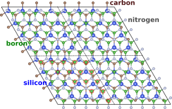

# Defective hBN/SiC Heterostructure using VASP-NEP-GPUMD

This project provides a guide for developing **machine learning interatomic potentials (MLIP)** and conducting molecular dynamics (MD) simulations with [GPUMD software](https://gpumd.org/).

This developed potential can be used to 
(i) assess the stability of the two-dimensional hBN/SiC heterostructure,
(ii) elucidate **Si–N bond formation** triggered by a boron vacancy (\$V_\mathrm{B}\$),
and (iii) investigate the behaviour of **Cu adatoms** on the defective hBN/SiC surface.

---

<p>
  
</p>

## Database Compilation

Detailed instructions are provided for building a robust database (DB).
[Density-functional theory (DFT)](https://www.synopsys.com/glossary/what-is-density-functional-theory.html) calculations were performed with the [Vienna Ab-initio Simulation Package (VASP)](https://www.vasp.at/) to obtain the total energy, atomic forces, and virial stress for each geometry.
Defects are introduced into a supercell containg 100 boron (B), 100 nitrogen (N), 64 silicon (Si), and 64 carbon (C) atoms.
Detailed information on the geometries and structures used to construct a stable interatomic potential is provided below.

#### 1. Boron Vacancy (\$V_\mathrm{B}\$) Defects
**Lattice mismatch** lead to 15 symmetry-distinct \$V_\mathrm{B}\$ defects in the heterostrcuture supercell, marked by the red circles in the figure. All unique defects were created, and their geometries were optimized. Depending on the VB site, various numbers of local chemical bonds (ranging from 0 to 4) are formed. Geometry-optimization (using ISIF=4) trajectories are stored in the VASP `XDATCAR` files.
The workflow then proceeds in two steps:
- Use the script `src/vasp_structure_rattler_deformer.py` with `--max_strain=0.05`, `--max_amplitude=0.1`, and `--step_size=2` to generate `POSCAR` files from XDATCARs (forming a dataset of about **1113 structures**).
- Perform single-shot DFT calculations (with higher precision) for these structures.

#### 2. Ab-Initio Molecular Dynamics for Stable Defects
- For the **most stable defect structure** (with 4 chemical bonds), ab-initio molecular dynamics (AIMD) simulations were conducted:
  - **Temperature:** 500 K
  - **Ensemble:** NVT
  - **Numer of steps:** 6000 steps
- Using `--step_size=5`, `--max_strain=0.0`, and `--max_amplitude=0.0`, we added 600 additional structures to the DB and performed DFT calculations for each of them.

#### 3. Pristine System
- For the pristine system, **120 additional structures** were generated through atomic rattling, in-plane layer shifting, and variations in interlayer distances, and subsequently added to the database. To mimic interlayer sliding, the hBN sheet was incrementally translated from (0, 0) to (ax/2, ay/2), where the rectangular SiC lattice parameters are ax = 3.09 Å and ay = 5.35 Å.

#### 4. Di- and Tri-Boron Vacancy defects
- To expand our DB with higher concentrations and random defect geometries, we generated unique defect configurations by randomly removing two and three boron vacancies. This dataset contributed 400 new entries to the DB.

#### 5. Data Enhancement via Iterative Model Refinement
An initial NEP model was trained on the 2233 configurations described above. Using this model, we performed GPUMD molecular dynamics simulations to identify configurations exhibiting non-physical behavior or other notable characteristics. These newly identified configurations were iteratively added to the database and used to retrain the potential, progressively enhancing its accuracy and stability. The MD simulations were conducted in the NPT ensemble (isothermal–isobaric) using the Berendsen barostat (P = 1 kbar). A range of temperatures from 200 K to 1000 K was explored during these calculations. In total, 901 new configurations were added to the DB, including pristine structures as well as mono- and tri-boron vacancies.
Note, the supercells used in this case are rectangular and contain the same number of atoms as the original triangular cell.

<table border="1"><tr><td>
<strong>NOTE&nbsp;</strong>─ Next, we broaden the database to capture the nuanced anchoring of Cu adatoms on the hBN/SiC surface. What follows are the carefully crafted steps taken to enrich and deepen the database’s understanding.
</td></tr></table>

#### 6. AIMD simulations of Boron monovacancies
- For four energetically distinct defective hBN/SiC structures, resulted by various number of **N-Si bonds**, we performed AIMD simulations similar to `Step 2`. One structure was extracted every 300 steps, resulting in a total of 80 new configurations added to the database.

#### 7. Configurational Coordinates Transitioning from Bonded to Non-Bonded Structures
- Copper atoms can be introduced into both interlayer bonded and non-bonded structures. To investigate the transition barrier, we explored the energy profile along a one-dimensional coordinate. A total of 21 structures, along with their rattled and deformed counterparts (42 structures in total), were added to the database.

<table border="1"><tr><td>
<strong>NOTE&nbsp;</strong>─ Using the updated database, a new NEP model was trained to enhance accuracy, and the process of `Data Enhancement via Iterative Model Refinement` will continue in a sequential manner by adding more Cu atoms. The hBN/SiC surface migth host several Cu and \$V_\mathrm{B}\$ defect.
</td></tr></table>

- 

### How to Use `vasp_structure_rattler_deformer.py`

The `vasp_structure_rattler_deformer.py` script generates strained and rattled `POSCAR` files from a VASP `XDATCAR`.

#### Example Command
Run the script with the following command:
```bash
python vasp_structure_rattler_deformer.py \
    --max_strain 0.05 \
    --max_amplitude 0.01 \
    --start_structure_id 1 \
    --vasp_file ~/XDATCAR \
    --step_size 1 \
    --number_of_rattling 1
```
### Command-Line Parameters

| Parameter | Description | Example|
| ------ | ------ | ------ |
| `--max_strain` | Maximum random strain to apply. | `0.05`
| `--max_amplitude` | Maximum random displacement amplitude. | `0.1`
| `--start_structure_id` | Starting ID for generated structures, greater than 0. | `1`
| `--step_size` | Interval to extract structures from file. | `1`
| `--number_of_rattling` | Number of rattle operations for each configuration. | `1`
| `--vasp_file`  | Path to the VASP structure file. This argument is required. | `./XDATCAR`
| `--output_dir` | Directory to store the generated POSCAR files. | `./poscars_db`


### Repository Structure


### Citation
If you use this workflow or data in your research, please cite the following:
  - our paper ...

### License
This project is licensed under the MIT License. See the LICENSE file for details.


### How to Save and Use
1. Copy the above content and save it to a file named `README.md` or another appropriate name in your repository.
2. Place it in the root directory or the specific project folder.
3. Rendered markdown will automatically be readable on GitHub or other markdown-compatible platforms.

Let me know if you'd like to further customize it!
